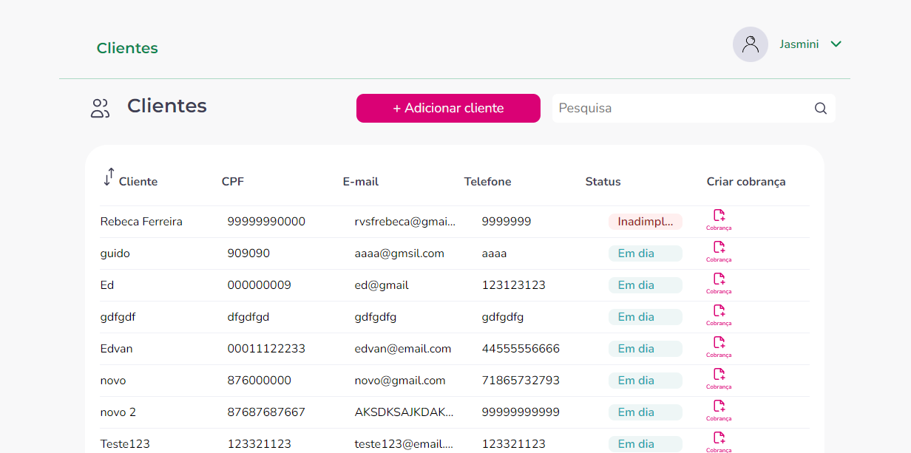
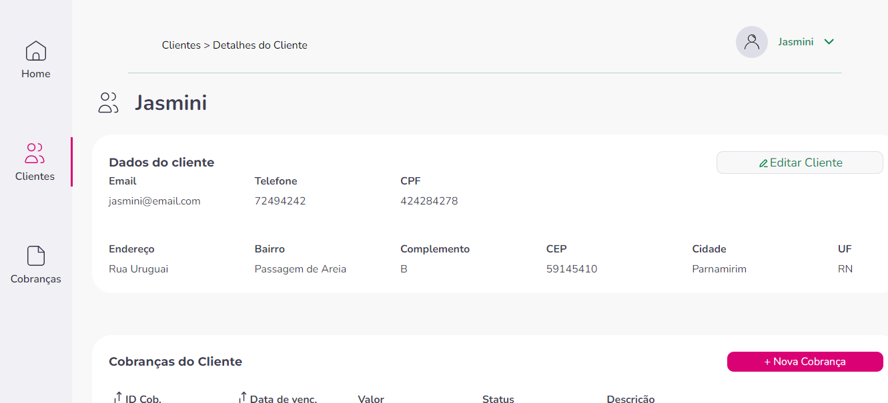

Desafio Final Módulo 5

    O projeto final do curso de desenvolvimento de software da Cubos Academy foi uma aplicação completa para cadastro de usuários, clientes e cobranças.

    
    
    
    
    

